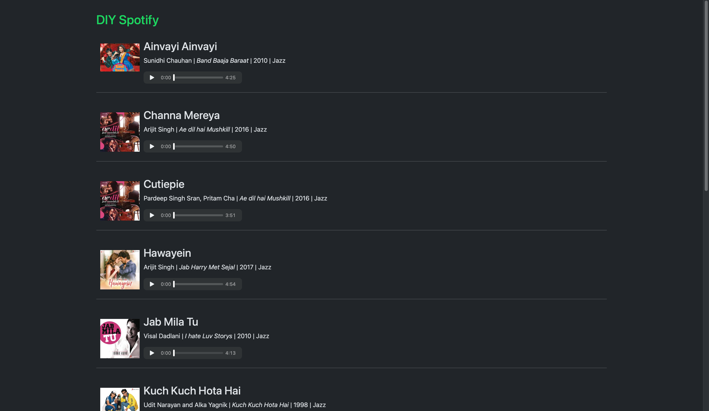

# Spotify Clone

This project is a custom Spotify-like platform where songs are dynamically uploaded and displayed on the website. It leverages AWS services, a database, and an external API to manage and deliver a seamless user experience.

## Features
- **AWS S3 Integration**: Songs are stored in an S3 bucket for secure and scalable storage.
- **Lambda Functions**: Automatically upload songs to the website when added to the S3 bucket.
- **Database**: Tracks and stores metadata for songs, such as title, artist, and upload date.
- **External API Integration**: Provides additional functionality, such as fetching song details
- **Dynamic UI**: A responsive web interface displays the uploaded songs in real-time.

## How It Works
1. A song is added to the AWS S3 bucket.
2. An AWS Lambda function is triggered by the S3 event, which:
   - Processes the uploaded file.
   - Extracts metadata.
   - Updates the database.
3. The website dynamically fetches and displays the new song using the API and database.

## Technologies Used
- **AWS Services**: S3, Lambda, EC2
- **Database**: Created a database
- **External API**: [FastAPI](https://github.com/xqd7aq/fastapi)
- **Programming Language**: Python, SQL
- **Tools** Docker

## Updates and Future Enhancements
1. **Music Playback**: Add streaming functionality for uploaded songs.
2. **Playlist Management**: Users can create and organize playlists.
3. **Search and Filters**: Search songs by title, artist, or genre.
4. **Dynamic UI**: Enhance the frontend with a modern, responsive design.
5. **Song Metadata**: Display album art, duration, and genre from song metadata.
6. **Like and Rating System**: Allow users to rate and like their favorite tracks.
7. **Recommendations**: Suggest songs based on user preferences.

This repository contains work that is part of an academic project. While some sections/code/files were developed by me, other components were provided by my professor as part of the course materials. 